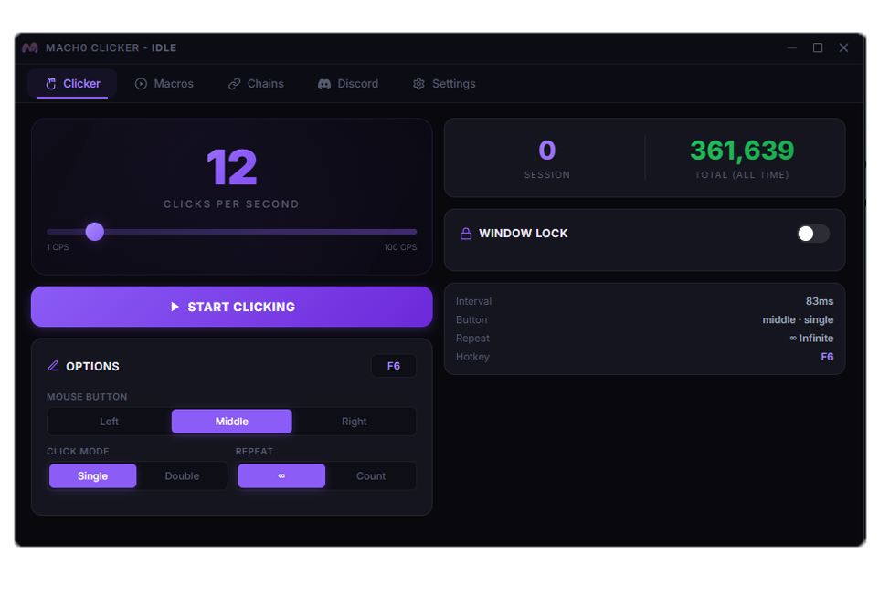
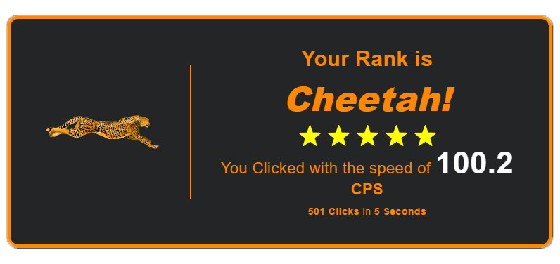

# 🖱️ MachoClicker

<p align="center">
  <a href="https://github.com/chivf/MachoClicker/releases/latest">
    
  </a>
</p>

MachoClicker is a modern, high-performance, and feature-rich desktop automation tool built with **Electron, React, and Vite**. Designed with a sleek dark-themed UI, glassmorphism accents, and rich micro-animations, it provides professional-grade clicker and macro sequencing tools for gamers, developers, and power users.

<p align="center">
  
</p>


---

## 🚀 Features

### ⚡ Smart Autoclicker
- **Click Types:** Support for Single/Double left, right, and middle clicks.
- **Interval Control:** Millisecond-level click speed customization.
- **Coordinate Picker:** Target specific screen coordinates or follow the mouse cursor dynamically.
- **Presets:** Save and restore customized click configurations on the fly.
- **Steady High CPS:** Maintains highly consistent and steady click speeds. *(500+ CPS engine optimization coming soon!)*

<p align="center">
  
</p>

### 🎬 Advanced Macro Recorder
- **Visual Playback Canvas:** Render, drag, and modify recorded action paths dynamically.
- **Actions Editing:** Add, delete, and move coordinate nodes.
- **Target Binding:** Bind macros to specific application windows or running processes.

### ⛓️ Action Chains (Sequencing)
- **Macro Chaining:** Combine multiple recorded macros in sequence.
- **Custom Delays:** Add custom pause/delay steps between macros.
- **Loop Modes:** Repeat sequences once, a specified number of times, or infinitely.
- **Custom Hotkeys:** Bind unique hotkeys to trigger individual chains instantly.

### 🤖 Discord Integrations
- **Webhook Updates:** Auto-broadcast status logs, CPS metrics, uptime, and auto-screenshots to a Discord channel.
- **Remote Bot Control:** Connect a custom Discord Bot to trigger commands like `/screen` (take a screenshot) or `/record` (record 10 seconds of output) remotely.
- **Discord Rich Presence (RPC):** Show off your clicking stats, active tab, and current session runtime on your Discord profile.

### 🌍 Multilingual Support
- Fully translated settings and controls with dynamic language switching (**English** & **Polish**).

---

## 🛠️ Tech Stack
- **Frontend Framework:** React 19 + Vite
- **Shell / Runtime:** Electron 36
- **System Automation:** `@nut-tree-fork/nut-js` & `uiohook-napi` (for system-level global keyboard/mouse hooks and automation)
- **Styling:** Vanilla CSS (Glassmorphism & dark-theme palette)

---

## 📦 Installation & Setup

1. **Clone the repository:**
   ```bash
   git clone https://github.com/chivf/MachoClicker.git
   cd MachoClicker
   ```

2. **Install dependencies:**
   ```bash
   npm install
   ```

3. **Run the development environment:**
   ```bash
   npm run dev
   ```

4. **Build production binaries:**
   ```bash
   npm run build
   ```
   *The built NSIS setup wizard will be saved inside the `release/` directory.*

---

## 📜 Installer Options (NSIS)
The compilation configuration uses a custom NSIS page wizard. When running `MachoClicker Setup [version].exe`, you can:
- Choose the preferred installation directory.
- Opt-in to creating a **Desktop Shortcut**.
- Opt-in to **Pin to Taskbar** (adds target to pinned applications).

---

## 🛡️ License
Distributed under the ISC License. See `LICENSE` for more information.

## 🧑‍💻 Author
Created with ❤️ by [czif](https://github.com/chivf).
